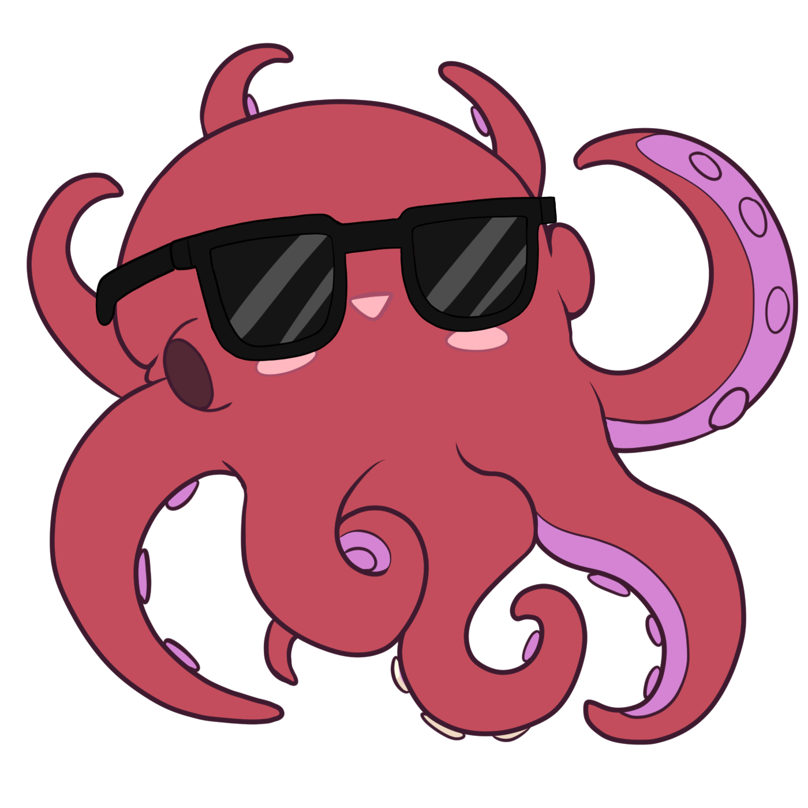

# Vidding Photosensitivity Relay

 Vidding is the name for the hobby of editing fan-videos. Photosensitive individuals are often overlooked when creating and sharing content, making it hard for them to find videos that are safe to view. The VPR system seeks to change this by offering information on how to relay content advisories for common photosensitive risks.

If you'd like to read more about what can cause seizures to further help rate your video, please see [WCAG](https://www.w3.org/TR/UNDERSTANDING-WCAG20/seizure-does-not-violate.html) (Web content accessibility guidelines) and/or [Prodicle's Photosensitivity Prevention Best Practice Guideline - Production](https://web.archive.org/web/20211130113204/https://help.prodicle.com/hc/en-us/articles/360044218174-Photosensitivity-Prevention-Best-Practice-Guideline-Production) (TODO: find a more reliable url or copy the content elsewhere as it's no longer public.)

This page is designed as a community-based collaboration. You can submit issues and pull requests to [the GitHub repository here]({{ site.github.repository_url }}).

| :---: |
| TL;DR: It's like a CW, but for photosensitivities |
